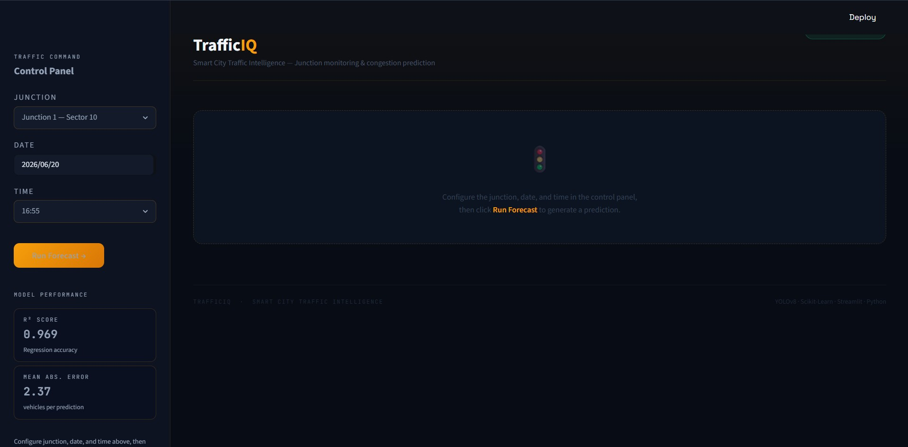

<div align="center">

# 🚦 TrafficIQ

### Smart City Traffic Intelligence System

[](https://python.org)
[](https://scikit-learn.org)
[](https://streamlit.io)
[](https://pandas.pydata.org)
[](LICENSE)

*Configure a junction, date, and time — TrafficIQ forecasts vehicle count, congestion level, and gives actionable management recommendations in real time.*

</div>

---

## Overview

**TrafficIQ** is an AI-powered urban traffic forecasting dashboard built for smart city operations. It uses a machine-learning regression model trained on multi-junction traffic data to predict vehicle counts at a given junction, time, and date — then classifies the result into a congestion tier and surfaces actionable recommendations for traffic management teams.

The system is built as a full-stack Python application: a Scikit-Learn model for inference, feature engineering in Python, and a Streamlit interface styled as an operations command center.

**Key capabilities:**

- **Vehicle count prediction** — regression model forecasts exact vehicle count per junction per hour
- **Congestion tiering** — LOW / MEDIUM / HIGH / PEAK classification with color-coded alerts
- **Risk score** — normalized 0–100% congestion risk index with a visual progress bar
- **Recommendation engine** — context-aware management actions based on predicted congestion
- **Feature transparency** — expandable panel shows all 12 engineered features passed to the model

---

## Model Performance

| Metric | Value |
|--------|-------|
| R² Score | **0.969** |
| Mean Absolute Error | **2.37 vehicles** |
| Algorithm | Regression (Scikit-Learn) |
| Input Features | 12 engineered features |

---

## Dashboard

<p align="center">
  
</p>

## Prediction demo

<p align="center">
  
</p>


---

## Project Structure

```
trafficiq/
├── traffic_app.py              # Streamlit application (main entry point)
├── models/
│   └── traffic_model.pkl       # Trained Scikit-Learn model  ← not tracked by git
├── notebooks/
│   └── training.ipynb          # Model training and evaluation notebook
├── assets/
│   └── demo.png                # Screenshot for README
├── requirements.txt
├── .gitignore
└── README.md
```

---

## Quickstart

### 1. Clone the repository

```bash
git clone https://github.com/your-username/trafficiq.git
cd trafficiq
```

### 2. Create and activate a virtual environment

```bash
python -m venv venv

# macOS / Linux
source venv/bin/activate

# Windows
venv\Scripts\activate
```

### 3. Install dependencies

```bash
pip install -r requirements.txt
```

### 4. Add the trained model

Place your trained model file inside the `models/` directory:

```
models/traffic_model.pkl
```

> The model file is not committed to this repository. See the **Model Training** section below to train your own, or obtain the weights separately.

### 5. Run the application

```bash
streamlit run traffic_app.py
```

The app opens at `http://localhost:8501`.

---

## Requirements

```
streamlit>=1.32.0
scikit-learn>=1.3.0
pandas>=2.0.0
numpy>=1.24.0
```

Install all dependencies:

```bash
pip install -r requirements.txt
```

Generate a fresh `requirements.txt` from your environment:

```bash
pip freeze > requirements.txt
```

---

## Feature Engineering

The model receives 12 engineered features extracted from junction ID, date, and time inputs:

| Feature | Type | Description |
|---------|------|-------------|
| `Junction` | int | Junction ID (1–4) |
| `Year` | int | Calendar year |
| `Month` | int | Calendar month (1–12) |
| `Day` | int | Day of month |
| `Hour` | int | Hour of day (0–23) |
| `DayOfWeek` | int | Weekday index (0 = Monday) |
| `IsWeekend` | binary | 1 if Saturday or Sunday |
| `IsHoliday` | binary | 1 if date is a public holiday |
| `WeekOfYear` | int | ISO week number |
| `Quarter` | int | Calendar quarter (1–4) |
| `Season` | int | 0=Winter, 1=Spring, 2=Summer, 3=Autumn |
| `RushHour` | binary | 1 if 08:00–10:00 or 17:00–20:00 |

---

## Model Training

Train a new model on your own junction traffic dataset:

```python
import pandas as pd
import pickle
from sklearn.ensemble import RandomForestRegressor
from sklearn.model_selection import train_test_split
from sklearn.metrics import r2_score, mean_absolute_error

# Load dataset
df = pd.read_csv("data/traffic.csv", parse_dates=["DateTime"])

# Feature engineering
df["Year"]       = df["DateTime"].dt.year
df["Month"]      = df["DateTime"].dt.month
df["Day"]        = df["DateTime"].dt.day
df["Hour"]       = df["DateTime"].dt.hour
df["DayOfWeek"]  = df["DateTime"].dt.weekday
df["IsWeekend"]  = (df["DayOfWeek"] >= 5).astype(int)
df["WeekOfYear"] = df["DateTime"].dt.isocalendar().week.astype(int)
df["Quarter"]    = df["DateTime"].dt.quarter
df["RushHour"]   = df["Hour"].apply(
    lambda h: 1 if (8 <= h <= 10) or (17 <= h <= 20) else 0
)

FEATURES = [
    "Junction", "Year", "Month", "Day", "Hour",
    "DayOfWeek", "IsWeekend", "IsHoliday",
    "WeekOfYear", "Quarter", "Season", "RushHour"
]

X = df[FEATURES]
y = df["Vehicles"]

X_train, X_test, y_train, y_test = train_test_split(
    X, y, test_size=0.2, random_state=42
)

model = RandomForestRegressor(n_estimators=200, random_state=42)
model.fit(X_train, y_train)

preds = model.predict(X_test)
print(f"R²  : {r2_score(y_test, preds):.4f}")
print(f"MAE : {mean_absolute_error(y_test, preds):.2f}")

# Save
with open("models/traffic_model.pkl", "wb") as f:
    pickle.dump(model, f)
```

---

## Congestion Classification

Predictions are mapped to four congestion tiers:

| Tier | Threshold | Color | Action |
|------|-----------|-------|--------|
| LOW | ≤ 10 vehicles | 🟢 Green | No intervention |
| MEDIUM | 11–20 vehicles | 🟡 Yellow | Passive monitoring |
| HIGH | 21–40 vehicles | 🟠 Orange | Prepare diversions |
| PEAK | > 40 vehicles | 🔴 Red | Deploy traffic police |

The **congestion risk score** normalises the prediction to a 0–100% index:

```
Risk Score = min(predicted_vehicles / 50 × 100, 100)
```

---

## How It Works

```
User selects junction + date + time
            │
            ▼
    Feature engineering
    (12 features extracted)
            │
            ▼
    model.predict(features)
            │
            ▼
    Congestion tier classification
    LOW / MEDIUM / HIGH / PEAK
            │
            ▼
    Risk score normalisation (0–100%)
            │
            ▼
    ┌───────────────────────┐
    │  KPI cards            │
    │  Risk progress bar    │
    │  Forecast summary     │
    │  Smart alert banner   │
    │  Recommendations      │
    └───────────────────────┘
```

---

## Configuration

| Parameter | Default | Location | Description |
|-----------|---------|----------|-------------|
| Model path | `models/traffic_model.pkl` | `traffic_app.py` line 20 | Path to trained model |
| Confidence threshold | `0.25` | — | N/A for regression |
| Rush hour window | `08:00–10:00, 17:00–20:00` | `traffic_app.py` feature block | Hours treated as peak |
| Peak vehicle threshold | `40` | `traffic_app.py` | Vehicles above which PEAK is triggered |
| Risk normaliser | `50` | `traffic_app.py` | Denominator for risk score calculation |

---

## Roadmap

- [ ] Multi-junction side-by-side comparison view
- [ ] 24-hour traffic forecast chart (hourly breakdown)
- [ ] CSV export of prediction results
- [ ] Historical trend visualisation from uploaded datasets
- [ ] REST API endpoint using FastAPI
- [ ] Docker container for one-command deployment
- [ ] Real-time data ingestion via traffic sensor API

---

## Contributing

Contributions are welcome. Please open an issue first to discuss what you would like to change, then submit a pull request against the `main` branch.

```bash
# Fork the repo, then:
git checkout -b feature/your-feature-name

# Make your changes
git commit -m "feat: describe your change clearly"
git push origin feature/your-feature-name

# Open a Pull Request on GitHub
```

Please follow the existing code style and keep commits focused on a single change.

---

## License

Distributed under the [MIT License](LICENSE). See `LICENSE` for full details.

---

<div align="center">

Built with 🚦 using [Scikit-Learn](https://scikit-learn.org) · [Streamlit](https://streamlit.io) · [Pandas](https://pandas.pydata.org) · Python

</div>

---
## Author

Shadrack A

Machine Learning & Data Science Internship Project
